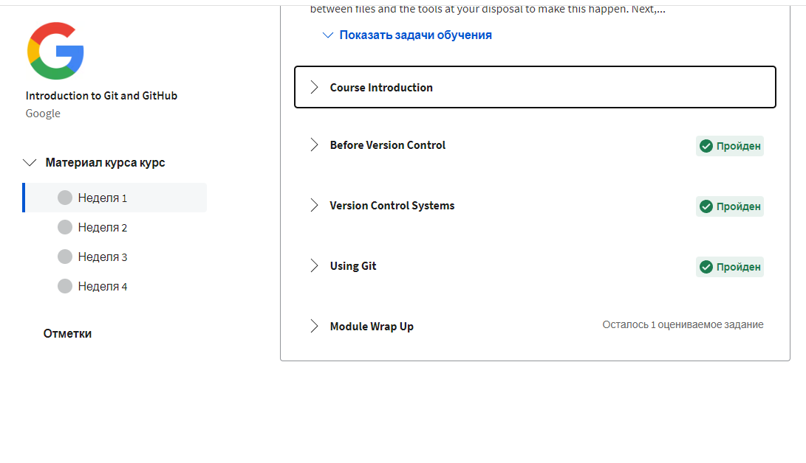
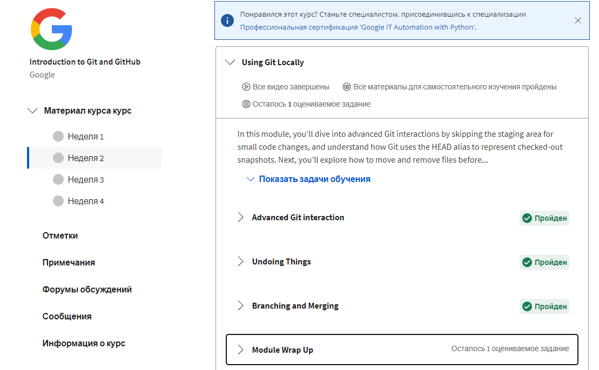
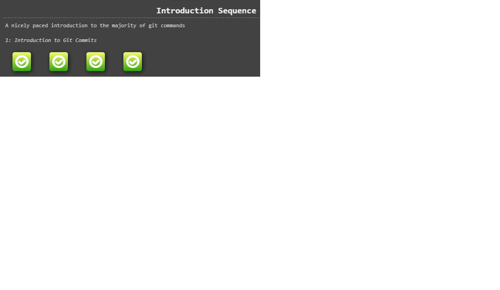
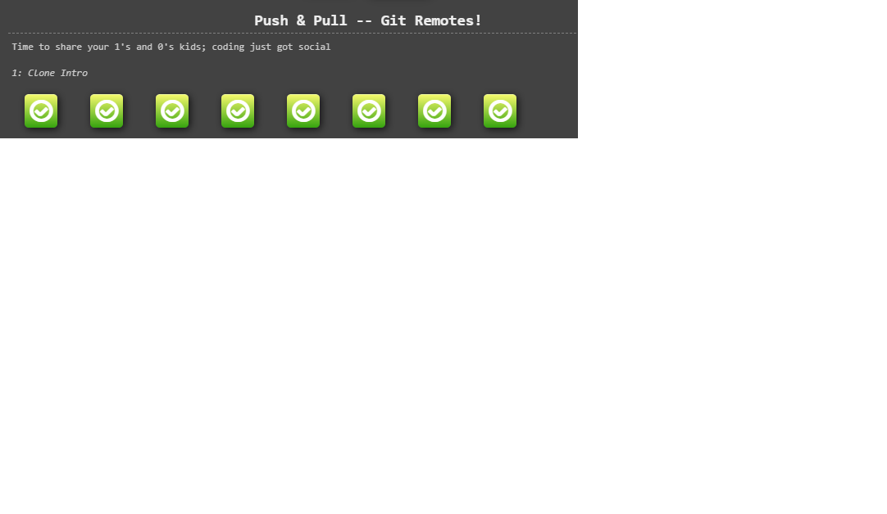
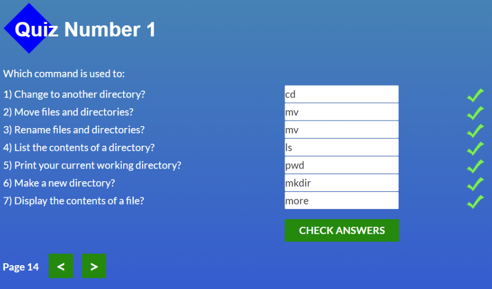
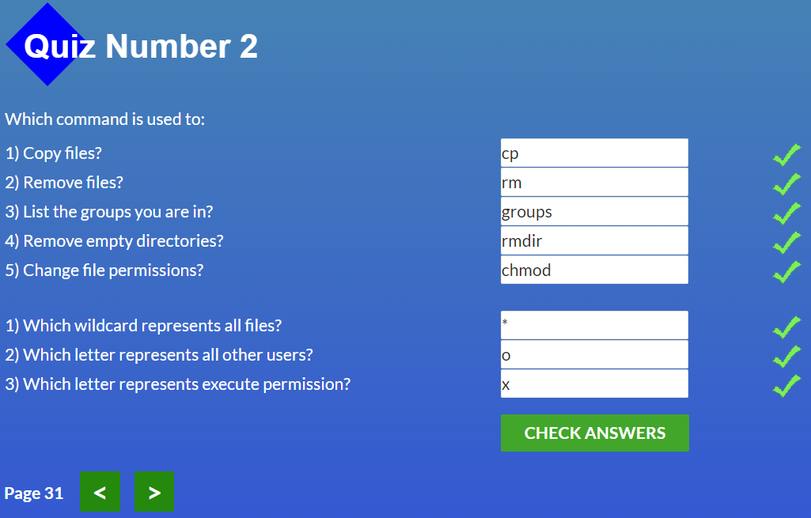
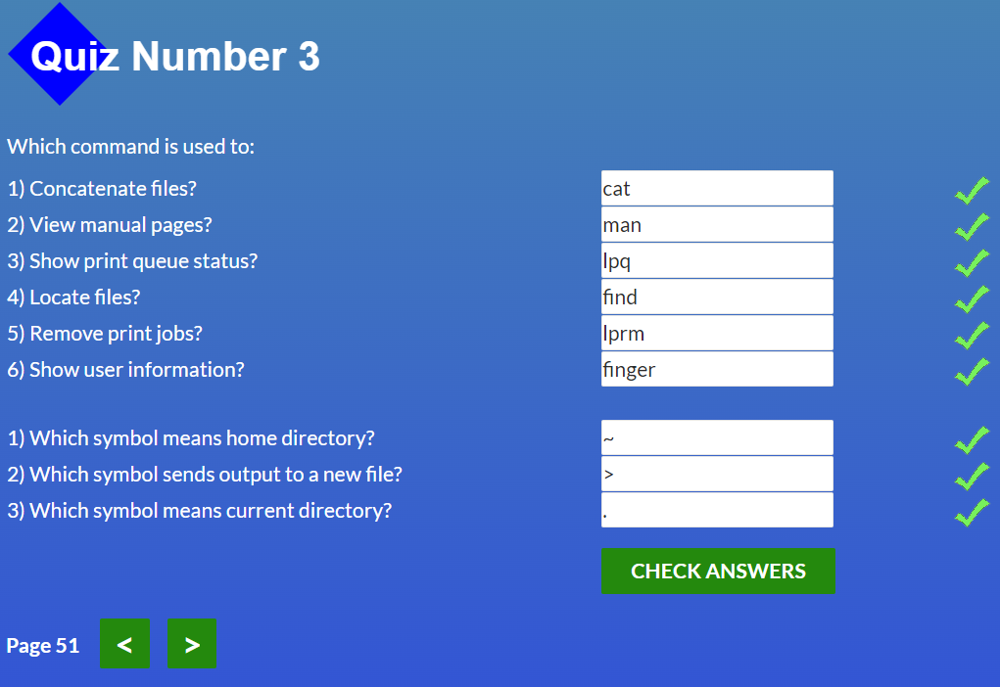
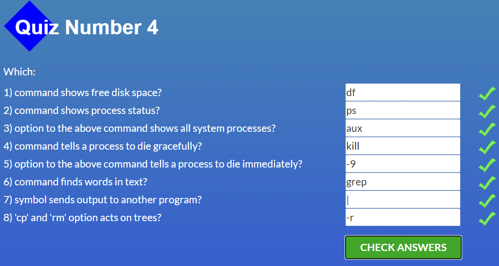

# kottans-frontend

## Git Basics

 
Click to expand!

 
 
 
 
 1. Everything for me was new in a course on 
 [Coursera](https://www.coursera.org/learn/introduction-git-github), 
 i finished the whole course, also 3 and 4 weeks(for experience). 
 2. There were some **hard** commands, but with practice it's become more **understandable**.  Also i really like [learngitbranching](https://learngitbranching.js.org) for practice.
 3. I'm sure i'll use these commands with my *future projects* and at *work*.

## Linux CLI, and HTTP

### Linux Course
 
Click to expand!

 
 
 
 
 1. **Everything** for me was new in this course and i really like examples with zoo, it makes learning **easier**.
 2. I was **surprised** by how interesting it is to use *manual* commands in the  software to move, remove files, etc.
 3. I'm not sure i will use these commands in the *future* in the Linux system(*because i don't know if i will install it*), but they will be *useful* in GIT.

### HTTP Protocol, part 1
 1. **Everything** for me was new in this article.
 2. I was **surprised** and was interested in status codes(*obviously because faced with 404 error xD*)
 3.  In the future i think **i will use** status codes *during development* and also other information from this article *during work with browser*.

